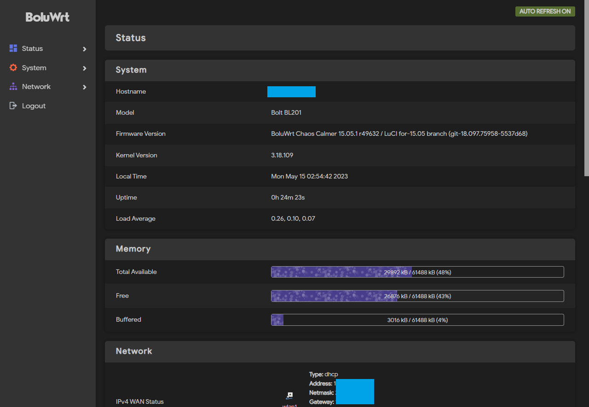

<div align="center">

# BoluWrt-bl201

OpenWrt dengan kustomisasi kernel untuk memperbaiki masalah WiFi yang lemah.

**NOTES :** BL201 sekarang secara resmi didukung oleh [Lede](https://github.com/coolsnowwolf/lede), [Immortalwrt](https://github.com/immortalwrt/immortalwrt), dan [X-WRT](https://github.com/x-wrt/x-wrt).

</div>
<div align="left">
  
  
### Screenshoot




### Changelog :

  #### [BoluWrt 3.1](https://github.com/yHpgi/openwrt-bl201-boluwrt/releases/tag/3.1) | Terbaru

    1. Didasarkan pada LEDE 17 / Custom compile untuk Bolt-BL201
    2. Menggunakan bolu-theme sebagai tema default
    3. Pengoptimalan driver WiFi
    4. OPKG berfungsi
    5. Semua LED berfungsi
    6. Semua port berfungsi
    7. Tombol reset berfungsi
    8. Tombol WPS sengaja dimatikan

  #### [BoluWrt 2.2](https://github.com/yHpgi/openwrt-bl201-boluwrt/releases/tag/BOLUWRT-CC)

    Based on Chaos-calmer 15.05.1 / Custom compile untuk Bolt-BL201
    
    1. Init build untuk Bolt-BL201
    2. Semua LED berfungsi
    3. Semua port berfungsi
    4. Tombol reset berfungsi
    5. Tombol WPS sengaja dimatikan
    6. Dua farian (dengan dan tanpa MWAN3)
    7. OPKG berfungsi
    8. Performa paling baik ketimbang versi sebelumnya

    Kelemahan: Tidak semua tema bisa dipasang disini, itu sebabnya saya hanya memasukkan tema bootstrap pada build ini.
      
<div align="justify">
  
  
### Penginstalan :

  #### 1. Menggunakan Breed-Web

  - Instal [Breed-web](https://breed.hackpascal.net)
    * Harap berhati-hati saat menggunakan Breed-web. karena hanya tersedia dalam bahasa mandarin. pastikan Anda paham menu apa yang Anda klik.
    * Breed image bisa didapatkan [disini](https://breed.hackpascal.net/), pilih `breed-mt7620-reset26.bin`.
  
   - Nyalakan Router sambil menekan tombol reset.
   - Masuk ke halaman Breed-web. Alamat IP Breed-web adalah `192.168.1.1`.
   - Masuk ke menu upgrade lalu masukkan file sysupgeade pada kolom kedua dan eeprom pada kolom ketiga.
   - Lalu klik mulai. konfirmasi penginstallan dan tunggu proses flashing berjalan hingga selesai.

#### 2. Menggunakan Openwrt sysupgrade
  
  - Aplikasi yang diperlukan :
  
    a. [Putty](https://www.putty.org/)
  
    b. [WinScp](https://winscp.net/eng/download.php)
    
  - Langkah-langkah :
  
    a. Login ke perangkat melalui WinScp dengan username dan password Openwrt anda;
  
    b. Unggah file sysupgrade ke folder `/tmp/` menggunakan WinScp;
  
    c. Lalu buka putty, Login;
  
    d. ketikkan perintah berikut :
  
      `sysupgrade -v -F -n /tmp/boluwrt-blablabla.bin`
  
    e. tekan Enter. dan tunggu proses flashing hingga selesai.
  
#### 3. Melalui LUCI
  
  - Melalui menu upgrade di Openwrt

### Lain-lain :

```
Password login                    : (kosong)
Password WiFi (2.4Ghz dan 5Ghz)   : (kosong)
Default IP                        : 192.168.1.1
```

Link berguna:
  [voycn](https://www.voycn.com/article/bianyimoujiyuopenwrtdesdk) 
  [csdn](https://blog.csdn.net/kuangzuxiaoN/article/details/121458746)
  </div>
</div>
