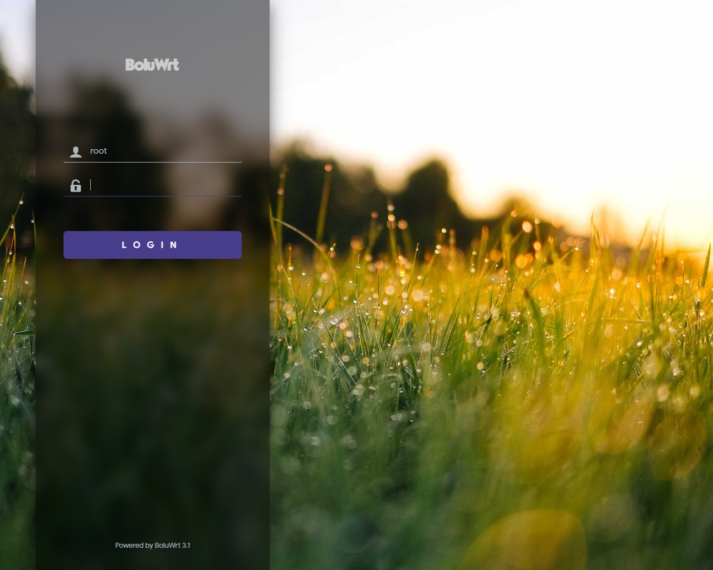
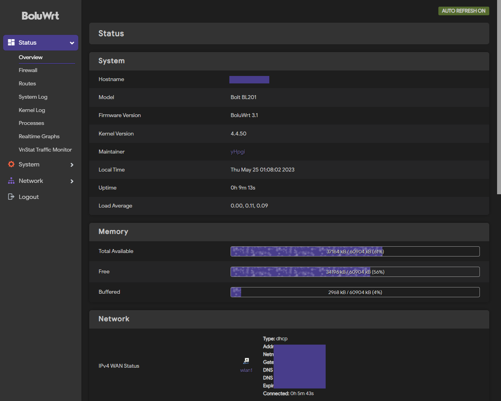

<div align="center">

# BoluWrt-BL201

OpenWrt dengan kustomisasi kernel untuk memperbaiki masalah WiFi yang lemah.

<div align="left">
  
### Disclaimer:
  
- Public archived. Project ini dihentikan hingga waktu yang belum ditentukan. Tidak menutup kemungkinan repository ini juga akan dihapus dikemudian hari.
- Source kode ini outdated. Anda perlu memperbaiki banyak hal saat compile.

</div>

**NOTES :** BL201 sekarang secara resmi didukung oleh [Lede](https://github.com/coolsnowwolf/lede), [Immortalwrt](https://github.com/immortalwrt/immortalwrt), dan [X-WRT](https://github.com/x-wrt/x-wrt).

</div>
<div align="left">
  
  
## Screenshoot




## Changelog :

  #### [BoluWrt v6-R21.8.23](https://github.com/yHpgi/openwrt-bl201-boluwrt/releases/tag/v6-R21.8.23) - 31 Agustus 2023

    1. Based on Openwrt 21.02
    2. Bootstrap sebagai tema default
    3. Penambahan support WPA3
    4. LED Sinyal LTE digunakan sebagai internet detector
        > Berkedip merah jika tidak ada internet
        > Berkedip biru jika internet tersedia
    5. LED Power biru aktif secara default
    6. Default password : bolu
  
  #### [BoluWrt v5.8](https://github.com/yHpgi/openwrt-bl201-boluwrt/releases/tag/v5.8) - 03 Juni 2023

    1. Kernel 4.4.92;
    2. Porting Luci ke Master branch;
    3. Porting Wifi driver dari chaos-calmer;
    4. Source opkg dipindah, semua aksi penginstalan dapat dilakukan, e.g: kmod, dll; 
    5. Bisa sysupgrade / tanpa harus full install.
    6. Default password: bolu

  #### [BoluWrt v4.3](https://github.com/yHpgi/openwrt-bl201-boluwrt/releases/tag/v4.3) - 28 Mei 2023
  
  ```diff
  - REDACTED
  ```
  
  #### [BoluWrt v3.1](https://github.com/yHpgi/openwrt-bl201-boluwrt/releases/tag/3.1) - 25 Mei 2023

    1. Didasarkan pada LEDE 17 / Custom compile untuk Bolt-BL201
    2. Menggunakan bolu-theme sebagai tema default
    3. Pengoptimalan driver WiFi
    4. OPKG berfungsi
    5. Semua LED berfungsi
    6. Semua port berfungsi
    7. Tombol reset berfungsi
    8. Tombol WPS sengaja dimatikan

  #### [BoluWrt v2.2](https://github.com/yHpgi/openwrt-bl201-boluwrt/releases/tag/BOLUWRT-CC) - 13 Mei 2023

    Based on Chaos-calmer 15.05.1 / Custom compile untuk Bolt-BL201
    
    1. Init build untuk Bolt-BL201
    2. Semua LED berfungsi
    3. Semua port berfungsi
    4. Tombol reset berfungsi
    5. Tombol WPS sengaja dimatikan
    6. Dua farian (dengan dan tanpa MWAN3)
    7. OPKG berfungsi
    8. Performa paling baik ketimbang versi sebelumnya

    Kelemahan: Tidak semua tema bisa dipasang disini, itu sebabnya saya hanya memasukkan tema bootstrap pada build ini.
      
<div align="justify">
  
  
## Penginstalan :

  #### 1. Menggunakan Breed-Web

  - [Install Breed-web](https://github.com/yHpgi/openwrt-bl201-boluwrt/blob/main/INSTALL-BREED.md)
  - Nyalakan Router sambil menekan tombol reset.
  - Masuk ke halaman Breed-web. Alamat IP Breed-web adalah `192.168.1.1`.
  - Masuk ke menu upgrade, masukkan file 'sysupgrade' pada kolom firmware.
  - Klik mulai. konfirmasi penginstalan dan tunggu proses flashing berjalan hingga selesai.

#### 2. Menggunakan Openwrt sysupgrade
  
  - Aplikasi yang diperlukan :
  
    a. [Putty](https://www.putty.org/)
  
    b. [WinScp](https://winscp.net/eng/download.php)
    
  - Langkah-langkah :
  
    a. Login ke perangkat melalui WinScp dengan username dan password Openwrt anda;
  
    b. Unggah file sysupgrade ke folder `/tmp/` menggunakan WinScp;
  
    c. Buka putty, Login;
  
    d. ketikkan perintah berikut :
  
      ```
      sysupgrade -v -F -n /tmp/[nama-file.bin]
      ```
  
    e. tekan Enter. dan tunggu proses flashing hingga selesai.
  
#### 3. Melalui LUCI
  
  - Melalui menu upgrade di Openwrt

## Lain-lain :
  ```
  Password login        : tidak ada
  Password login v5.8   : bolu
  Password WiFi         : tidak ada
  Default IP            : 192.168.1.1
  ```


<div align="center">

### *BoluWrt dan/atau Openwrt sepenuhnya opensource, tapi jika berkenan, Anda bisa mendukung saya melalui sociabuzz.*


<a href="https://sociabuzz.com/yhpgi/tribe"></a>

</div>
